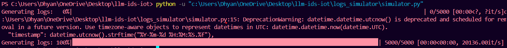
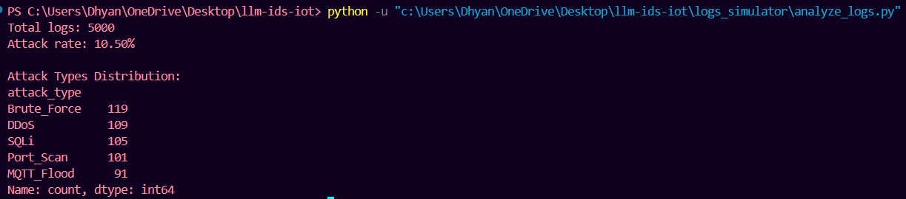

# LLM-Based IoT Intrusion Detection System

 Phase 1: IoT Log Simulator
Generates synthetic IoT/M2M logs with **normal** and **attack** traffic for training an AI-powered IDS.

 Features
- Simulates 20 IoT devices (`device_01` to `device_20`)
- Generates 5 attack types (DDoS, MQTT Flood, etc.)
- Outputs logs in JSONL format (1 log per line)

 Usage
```bash
# Install dependencies
pip install -r logs_simulator/requirements.txt

# Generate logs (5000 entries)
python logs_simulator/simulator.py

# Analyze logs
python logs_simulator/analyze_logs.py
```

 Sample Output
```json
{
  "timestamp": "2024-06-15 14:22:10.123456",
  "device_id": "device_07",
  "ip": "192.168.1.105",
  "protocol": "MQTT",
  "is_attack": true,
  "attack_type": "DDoS"
}
```



